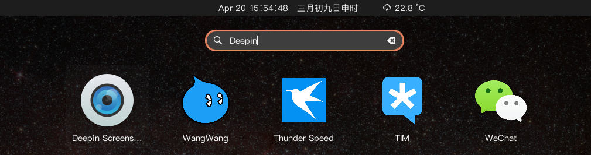

# 上手🎉️

本脚本依赖Docker，需要提前安装好Docker环境，如果以安装请忽略。

Debian/Ubuntu安装方法：

```bash
sudo apt update
sudo apt install docker.io -y
sudo usermod -aG docker $USER
```

超级简单的安装使用方法：

```bash
> bash -c "$(curl -L https://git.io/JORao)" @ install deepin.com.qq.office deepin.com.wechat

> docker-deepin help

Usage: docker-deepin COMMAND

Commands:

--init|init
      Init a new container.
--install|install app
      Install app to container and create Desktop file.
--run|run app
--remove|remove app
      Remove app(Desktop file).
--cleanup|cleanup
      Stop and remove current container.
--shell|shell|bash
      Enter current container shell.
--logs|logs
      Fetch the logs of a container

app list: 
      deepin.com.thunderspeed deepin.com.taobao.wangwang deepin.com.taobao.aliclient.qianniu
      deepin.com.qq.rtx2015 deepin.com.qq.office deepin.com.qq.im.light deepin.com.qq.im
      deepin.com.qq.b.eim deepin.com.qq.b.crm deepin.com.gtja.fuyi deepin.com.foxmail
      deepin.com.cmbchina deepin.com.baidu.pan deepin.com.aaa-logo deepin.com.95579.cjsc
      deepin.cn.com.winrar deepin.cn.360.yasuo deepin.com.wechat deepin.com.weixin.work
      deepin.net.263.em deepin.org.7-zip deepin.org.foobar2000 deepin.net.cnki.cajviewer

```

基本使用方法: 

1. `docker-deepin init`
2. `docker-deepin install deepin.com.wechat`
3. `docker-deepin run deepin.com.wechat` 或者 点击图标运行（install完已经生成图标了）

**遇到问题首先尝试：`docker-deepin cleanup`然后重新`docker-deepin init`。**




---

# 进阶🚀️

## 创建容器

```bash

docker run -d --name deepin \
    --device /dev/snd --ipc="host"\
    -v $HOME/deepin:/home/deepin \
    -v /tmp/.X11-unix:/tmp/.X11-unix \
    -v $HOME:$HOME \
    -e XMODIFIERS=@im=fcitx \
    -e QT_IM_MODULE=fcitx \
    -e GTK_IM_MODULE=fcitx \
    -e DISPLAY=unix$DISPLAY \
    -e AUDIO_GID=`getent group audio | cut -d: -f3` \
    -e VIDEO_GID=`getent group video | cut -d: -f3` \
    -e GID=`id -g` \
    -e UID=`id -u` \
    jachin007/deepin
```

## 安装软件

容器中自带了WeChat和TIM。

```bash
docker exec -t deepin sh -c "apt update && apt install -y  deepin.com.thunderspeed"

```

### 软件包列表

```bash
deepin.com.thunderspeed
deepin.com.taobao.wangwang
deepin.com.taobao.aliclient.qianniu
deepin.com.qq.rtx2015
deepin.com.qq.office
deepin.com.qq.im.light
deepin.com.qq.im
deepin.com.qq.b.eim
deepin.com.qq.b.crm
deepin.com.gtja.fuyi
deepin.com.foxmail
deepin.com.cmbchina
deepin.com.baidu.pan
deepin.com.aaa-logo
deepin.com.95579.cjsc
deepin.cn.com.winrar
deepin.cn.360.yasuo
deepin.com.wechat
deepin.com.weixin.work
deepin.net.263.em
deepin.org.7-zip
deepin.org.foobar2000
deepin.net.cnki.cajviewer
```

### 查询软件包列表

```bash
docker exec -t deepin sh -c "apt update && apt search  'Deepin Wine'"
```

## 启动

```bash
# docker exec -d deepin tim.sh
docker exec -d deepin runuser -u deepin  /opt/deepinwine/apps/Deepin-TIM/run.sh
# docker exec -d deepin wechat.sh
docker exec -d deepin runuser -u deepin  /opt/deepinwine/apps/Deepin-WeChat/run.sh
```

## 其它指令

```bash
#进入容器
docker exec -it deepin bash
#deepin身份进入
docker exec -it -u deepin deepin bash
#停止/启动容器
docker stop deepin
docker start deepin
#删除容器（出现问题时可以删除重建）
docker rm deepin -f
#查看日志
docker logs -f deepin
```

# 感谢

[https://github.com/bestwu](https://github.com/bestwu/docker-deepin)
